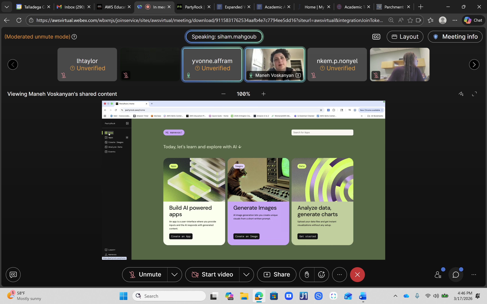
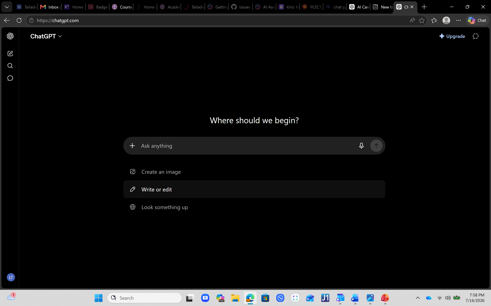
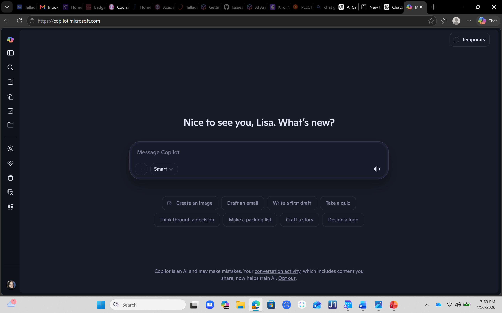

# Getting Started with PartyRock, ChatGPT, and Copilot

A step-by-step walkthrough for running **the same prompt** through three generative AI tools and
saving each response for comparison. Used with the
[final project](final-project-template.md), where those three outputs are scored side by side.

> **The rule that makes the comparison work:** paste the *exact same prompt* into all three tools.
> Do not change the wording between them. If the prompt changes, the comparison measures nothing.

---

## Part 1 — Using AWS PartyRock

### Step 1: Open PartyRock

Open your web browser and go to **<https://partyrock.aws>**.

### Step 2: Sign in

1. Click **Sign In**.
2. Select **Continue with Amazon**.
3. Log in using your Amazon account.
   - If you do not have one, click **Create your Amazon account**.
   - Follow the prompts.
   - Verify your email if requested.

> **Note:** PartyRock is free to use with an Amazon account.

### Step 3: Explore the home page

After logging in you will see:

- Featured AI Apps
- Search Bar
- My Apps
- Create App button

Take a few minutes to explore the interface.

### Step 4: Open a chat or AI app

Depending on your instructor's directions:

- Open the provided PartyRock app, **or**
- Create a simple AI app that accepts text input.

### Step 5: Paste your prompt

Copy your completed prompt and paste it into the prompt box.

**Example:**

| Element | Content |
|---|---|
| **Role** | You are an experienced career counselor. |
| **Context** | I am a Biology major interested in medical careers. |
| **Task** | Recommend five careers and explain how AI is changing each profession. |
| **Format** | Create a table. |
| **Constraints** | Limit to 500 words and use language appropriate for college students. |

### Step 6: Generate the response

Click **Generate** and wait for PartyRock to create the response.

### Step 7: Save your results

Choose one:

- Copy and paste into your report
- Take a screenshot
- Print to PDF

Label this section **PartyRock Output**.

---

## Part 2 — Using ChatGPT

### Step 1: Open ChatGPT

Go to **<https://chatgpt.com>**.

### Step 2: Sign in

Click **Log In** and use one of:

- Google
- Microsoft
- Apple
- Email address

Create a free account if needed.

### Step 3: Start a new chat

Click **New Chat**.

### Step 4: Paste your prompt

Paste **the exact same prompt** you used in PartyRock. **Do not change the wording.** This is what
allows you to compare the responses fairly.

### Step 5: Submit the prompt

Press **Enter** and wait for ChatGPT to respond.

### Step 6: Save the response

Copy the entire response into your report, or take a screenshot. Label it **ChatGPT Output**.

---

## Part 3 — Using Microsoft Copilot

### Step 1: Open Copilot

Go to **<https://copilot.microsoft.com>**.

### Step 2: Sign in

Click **Sign In** and use your Microsoft account. Create a free Microsoft account if needed.

### Step 3: Start a new conversation

Click **New Chat**.

### Step 4: Paste the same prompt

Paste the exact prompt used with PartyRock and ChatGPT. Again: **do not change the wording.**

### Step 5: Submit the prompt

Press **Enter** and allow Copilot to generate a response.

### Step 6: Save the response

Copy the response into your report, or take a screenshot. Label it **Microsoft Copilot Output**.

---

Once you have all three outputs saved and labelled, return to the
[final project template](final-project-template.md) and complete Parts 4 and 5 — the comparison
chart and the reflection questions.
