# Worked example — two assignments through the AI-Proofing Assistant

A recorded run of the app against two of the author's own political science assignments, kept as
evidence of what the tool actually produces rather than what it promises. Each assignment goes in
with its real instructions and rubric, a target maximum AI-only grade is set, and the app returns an
AI Robustness Score, a SWOT analysis, and three redesign options.

The full text of each redesign is in
[`../evaluation/`](../evaluation); the screenshots below are the app's own output.

Homepage:

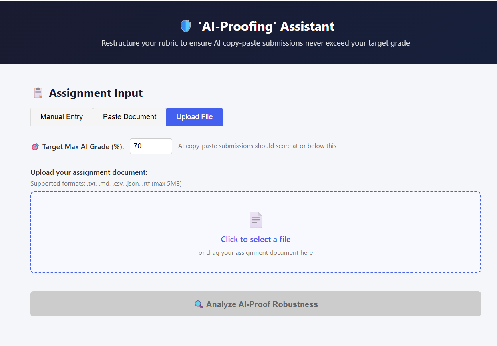

ReadMe:
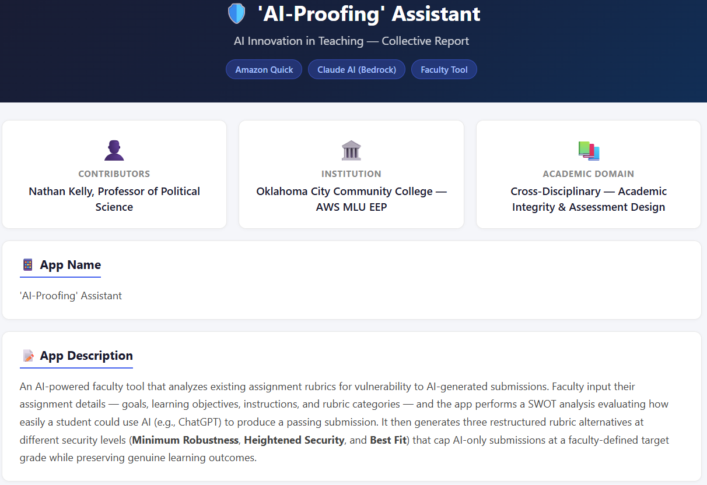
### Assignment 1 - Everyday Bureaucracy

#### Assignment Instructions + Rubric

For this assignment, students should watch the following short video about the impact of the Executive Branch through the bureaucracy. After viewing the video, students should review the data on Executive Branch Civilian Employment attached in the activity instructions found in this assignment. Students will reflect on these two sources to respond in writing to the prompts found in the activity instructions.

**Students should reflect on the video and the table of data to respond to the following prompts in the text-box provided in this assignment.** Student's responses should be around 200-400 words and address the following prompts:

- Which street-level bureaucrats discussed by Michael Lipsky do you have the most interaction with/rely upon the most? 
- What impact would you say these bureaucrats have had on your life thus far?  
- What do you think they mean when political scientists say that "street level bureaucrats are  policymakers"? 
- How can they impact policy when they are part of the executive not legislative branch?
- We often hear about the expansion of the government and the fear of an executive branch with increasing power. What does the following data table indicate to you about the size of the modern civilian government and the areas in which bureaucrats are most employed?  

**Video - Michael Lipsky Street-Level Bureaucrats** found @ https://www.youtube.com/watch?v=ZX1IivgPspA
**Data - Executive Branch Civilian Employment 1940-1950; 2000-2014** found at @ https://www.opm.gov/policy-data-oversight/data-analysis-documentation/federal-employment-reports/historical-tables/executive-branch-civilian-employment-since-1940/
_(all values in thousands: 10=10,000 employees; 1000=1 million employees)_

**Grading Rubric:**
- 0 points: This response does not fully address the prompt in a critical and personal way. Be sure to answer the question factually, and then add a personal touch that thinks critically about the question, the factual component of your response to that question. What do YOU think? WHY do you think that the facts you provided best answer the question?
- 0.5 points: While your answer addressed the question, you showed insufficient personal engagement. We want you to think critically AND provide your own analysis to your response. Spend a couple more minutes on how you structure your sentences or add a couple more sentences that provide a critical, personal touch to your submissions.
- 0.8 points: Good job answering question, however this does not demonstrate critical thinking so will be awarded 80%. Next time, add a couple more sentences that also demonstrate a critical thought process involved in your response. We want to hear your personal voice in your response. What do YOU think? WHY did you think this way?
- 1 point: Great considerations here. For many of these assignments there will not be a clear, correct answer. You did a great job communicating complex but valuable insights!
#### Assignment Output
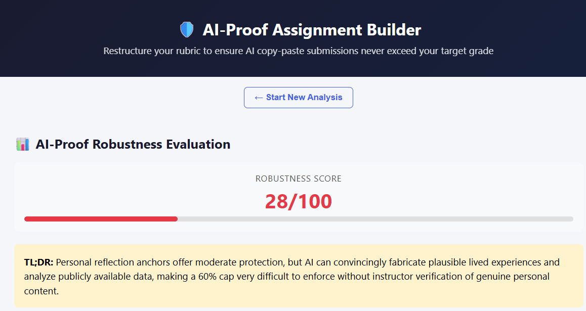
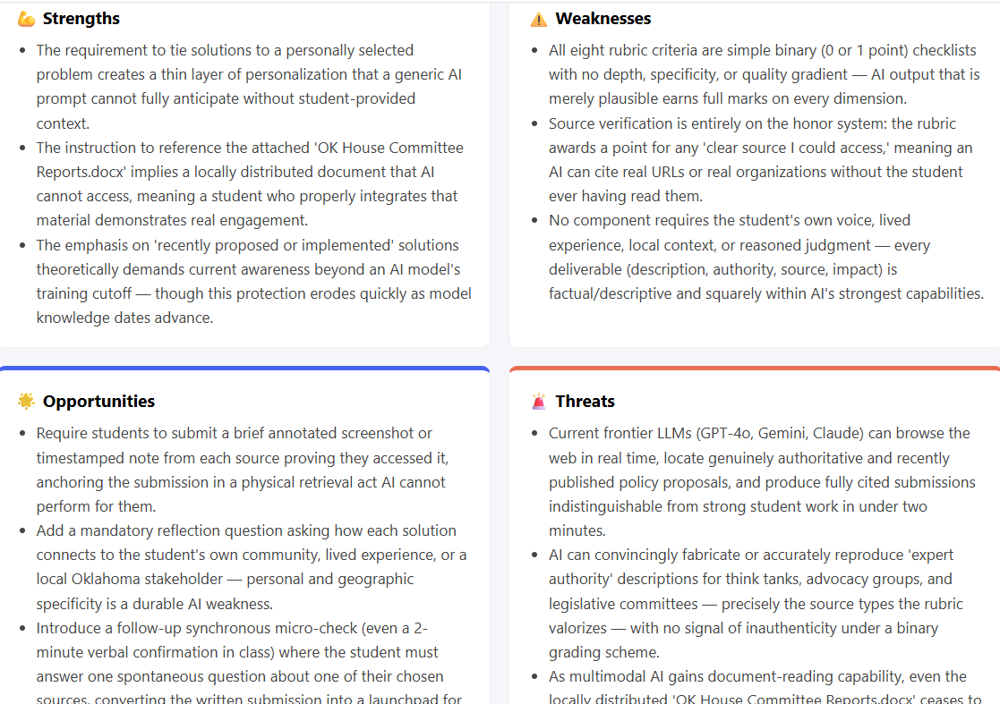
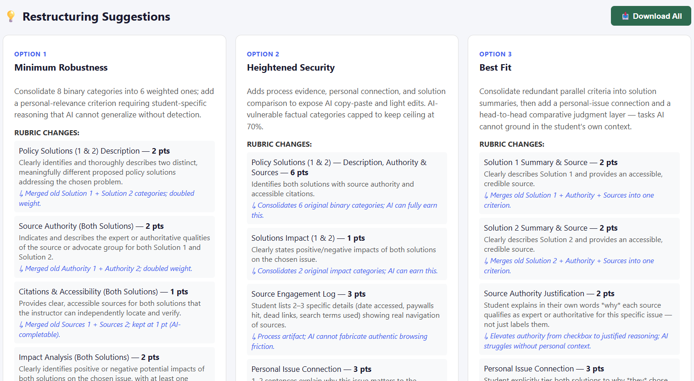
> *Screenshot missing.* In the author's original repository the "Heightened Security" image
> for this assignment is a byte-identical duplicate of the Minimum Robustness image above, so
> there is no recorded screenshot of this level. The full text of all three redesign levels is
> in [`everyday-bureaucracy-analysis.md`](../evaluation/everyday-bureaucracy-analysis.md).
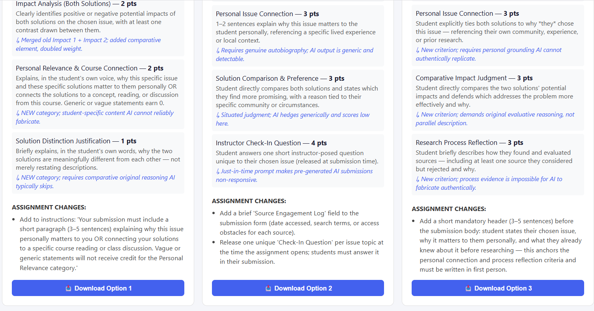
#### App Suggestions
Target max AI-only grade: **60%**. Full redesign output: [`everyday-bureaucracy-analysis.md`](../evaluation/everyday-bureaucracy-analysis.md).
### Assignment 2 - Potential Policy Solutions 
#### Assignment Instructions + Rubric
**Goals:** In this assignment, the student will identify and research **two** distinct proposed policy solutions to the problem the student has selected for the Policies that Matter essay. This will give the student an opportunity to focus the policy analysis portion of the upcoming writing assignment to existing practical solutions. This assignment should also help the student to focus their research and summary for the problem's history/background section of their essay draft.

**Objectives:** You should find, understand, and report on **two** distinct (meaningfully different) solutions that have been proposed or implemented recently to address the problem or issue facing America they have chosen. Be sure that these solutions come from a reliable expert or authority on the issue. Here I use the term expert and authority liberally - students should not feel that have to only rely on major successful authorities and experts. However, all expert or authoritative characteristics you may value in the source of your chosen policy solution should be investigated for some evidence of reliability. A good source are members who work within the broad policy process around your selected issue, or specific advocate groups that focus on your selected issue.  

**Grading criteria:** Rubric for Part 2 of the Policies that Matter to Me writing assignment.  

Rubric
| Criterion | 0 points | 1 point |
|---|---|---|
| **Policy Solution 1** | No first solution stated | Clearly identifies and thoroughly describes a distinct proposed policy solutions that address the stated selected problem or issue |
| **Solution 1 Authority** | Does not or poorly indicates the expert or authoritative qualities the solution 1's source | Indicates and describes the expert or authoritative qualities of the source or advocate group for Solution 1 |
| **Solution 1 Sources** | No sources for Solution 1 provided or unclear where I could find the solution | Provides clear source(s) for Solution 1 that I could access |
| **Solution 1 Impact** | No impact stated or unclear impact of Solution 1 on your chosen issue | Clearly identifies positive or negative potential impacts of Solution 1 on your chosen issue |
| **Policy Solution 2** | No second solution stated | Clearly identifies and thoroughly describes a distinct proposed policy solutions that address the stated selected problem or issue |
| **Solution 2 Authority** | Does not or poorly indicates the expert or authoritative qualities of solution 2's source | Indicates and describes the expert or authoritative qualities of the source or advocate group for Solution 2. |
| **Solution 2 Sources** | No sources for Solution 2 provided or unclear where I could find the solution | Provides clear source(s) for Solution 2 that I could access |
| **Solution 2 Impact** | No impact stated or unclear impact of Solution 2 on your chosen issue | Clearly identifies positive or negative potential impacts of Solution 2 on your chosen issue |
#### App Output
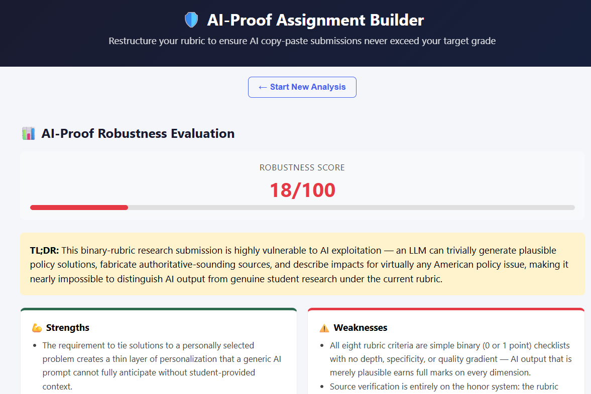
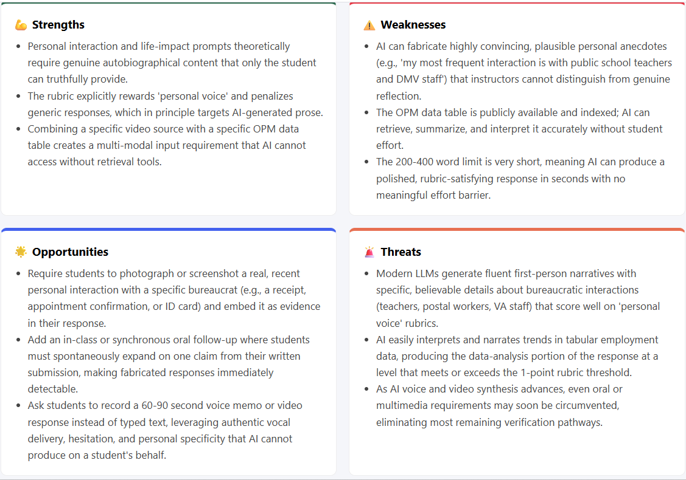
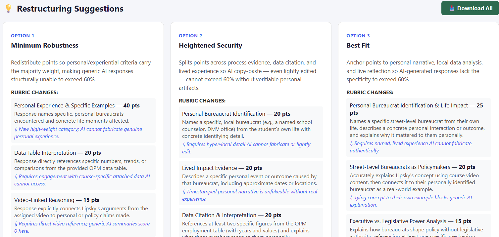
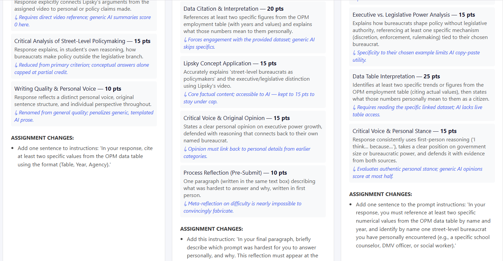
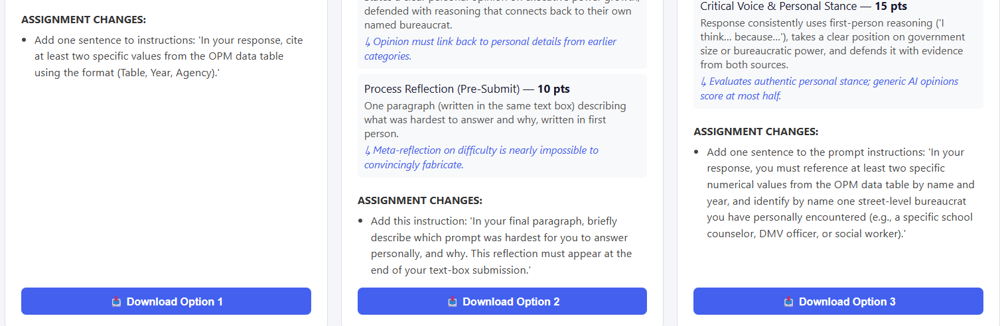
#### App Suggestions
Target max AI-only grade: **70%**. Full redesign output: [`exploratory-research-analysis.md`](../evaluation/exploratory-research-analysis.md).